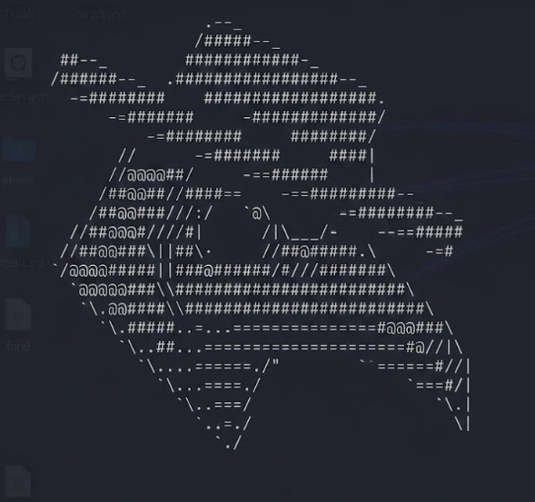

# [ 0xMauriceOS ]

<p align="center">
  
</p>

<p align="center">
  <a href="https://git.io/typing-svg">
    
  </a>
</p>

```text
[MSG] :: "The breach is the teacher. Silence is the control."
```

```text
operator@sn0w8ird:~$ cpointed --no-banner scan --host $TARGET --fingerprint
[*] loading module surface ...
operator@sn0w8ird:~$ _
```

### 0x00 | OPERATOR

```text
[ID]   Sn0w8irD
[DEPT] Red Team / Offensive Security
[SIG]  "Calmly breaking things (for good)"
[CERT] OSCP
```

### 0x01 | STACK

```text
[OFFSEC]  Burp Suite · Metasploit · custom Python tooling
[CODE]    Python · Go · TypeScript · C++
[OPS]     Kali · Linux · AWS · Docker
[DATA]    SQL / NoSQL persistence & reporting
```

### 0x02 | BUILDS

Offensive-security tools by **Sn0w8irD** (authorized use only):

```text
IDENT         ROLE                                      LINK
-----------   ----------------------------------------  ------------------
cpointed      hosting panel / WordPress CVE framework   github.com/MauriceOS/cpointed-framework
snaktox       AI-emergency workflows
Elimu-SMS     education platform core
AI-Pentest    recon automation
Toolkit-OST   red-team toolkit distribution
```

→ [cpointed-framework](https://github.com/MauriceOS/cpointed-framework)

```text
$ cpointed scan --host TARGET --fingerprint --wordpress
$ cpointed exploit --cve CVE-XXXX-XXXX --host TARGET   # CPOINTED_AUTHORIZED=1
```

### 0x03 | SECURE_HANDSHAKE

```text
[PUB_KEY] : ./GPG.txt
[GPG_FP]  : 0x60B172669D4B329C
            60B1 7266 9D4B 329C DB99 CB06 F1BC 40DF 12A3 D362
[PULSE]   : see pulse.log (weekly heartbeat)
```

```text
[!] LAST_PULSE (live): pulse.log
```

### 0x04 | LOG_TRAIL

```text
[0x0001] [OK] OSCP_VALIDATED
[0x0002] [OK] OFFENSIVE_TOOLING_SHIPPED (cpointed + builds above)
[0x0003] [OK] PANEL_AND_WP_ASSESSMENT_WORKFLOWS
[0x0004] [>>] AUTHORIZED_RESEARCH_ONLY
```

<p align="center">
  <sub>encrypted comms welcome · <a href="./GPG.txt">GPG.txt</a> · <a href="./pulse.log">pulse.log</a></sub>
</p>
